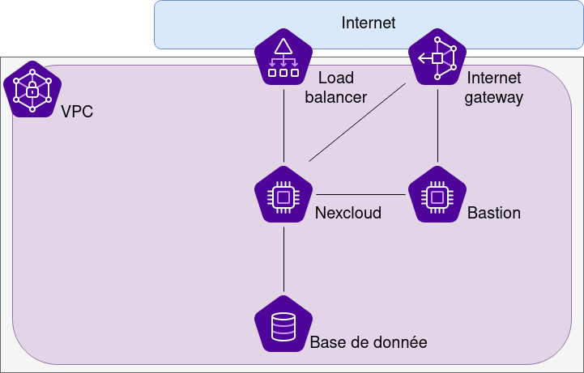

# Lab Scaleway VPC : Deploy a Nextcloud instance

This Git repository is link to this article [Test des réseaux privés Scaleway (Fr)]().

But, if you want to try this code, or just have fun, you can find all important information on this repository.

## Project

This project has to objective to deploy : 
* 1 VPC + 1 Internet Gateway (with a PAT configuration)
* 2 instances (bastion + hosting)
* 1 managed DB
* 1 Load balancer



> Disclaimer : this project is for testing and fun, he isn't prod ready (no HA, no TLS)

## Requirements 

General requirements :
* Have a [Scaleway (Element) account](https://www.scaleway.com/fr/) and token
* Basic knowledge of Terraform

Software requirements : 
* [Terraform](https://www.terraform.io/downloads)
* [Terragrunt](https://terragrunt.gruntwork.io/docs/getting-started/install/)
* [Scaleway cli](https://github.com/scaleway/scaleway-cli)

I strongly recommend using [asdf](https://github.com/asdf-vm/asdf) to install `Terra*`

## Deploy it 

### Configure your Scaleway account

To deploy this project, I use [authentification by profile](https://registry.terraform.io/providers/scaleway/scaleway/latest/docs#shared-configuration-file). You can configure it easily by putting on `$HOME/.config/scw/config.yaml` following configuration (obviously with your credentials and tokens) : 

```yaml
profiles:
  perso:
    access_key: xxxxxxxxxxxxxxxxxxxx
    secret_key: xxxxxxxx-xxx-xxxx-xxxx-xxxxxxxxxxx
    default_organization_id: xxxxxxxx-xxx-xxxx-xxxx-xxxxxxxxxxx 
    default_project_id: xxxxxxxx-xxx-xxxx-xxxx-xxxxxxxxxxx
    default_zone: fr-par-2
    default_region: fr-par
    api_url: https://api.scaleway.com
    insecure: false
```

### Configure your provider

After that you can create a private object bucket on Scaleway to manage states.

And update all configurations with your information on : `./terragrunt.hcl`

### Deploy Terraform code

`Terraform` is separate on 5 different layers to facilitate maintenance and deployment. Dependency between each layer and global deployment is handled by `Terragrunt`.

After that you can directly exec `Terraform` command on all layers by using : `terragrunt run-all [init|plan|apply|destroy]`

> Important note, you can encounter error on deployment due to largeness on deployment. If this happens just relaunch it :) 

### Terminate configuration

When you have finished to deploy all the stack, got the load balancer public IP and complete the form using following information :
* username : `Nextcloud`
* password : `./db_password.secret` (created on deployment)
* private IP : `10.1.0.200` on the default configuration.

Validate, wait like 4-5 minutes and enjoy.

## Other / notes

If you check the code you can see a script on `./bin/get_ip_from_hostname.sh`, this is a little script used on external datasource to retrieve lease from DHCP.
